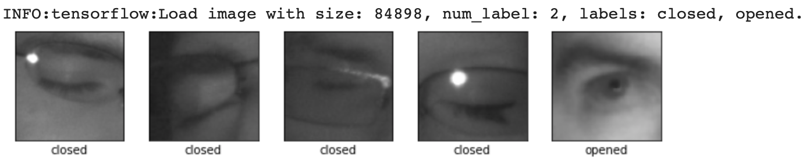
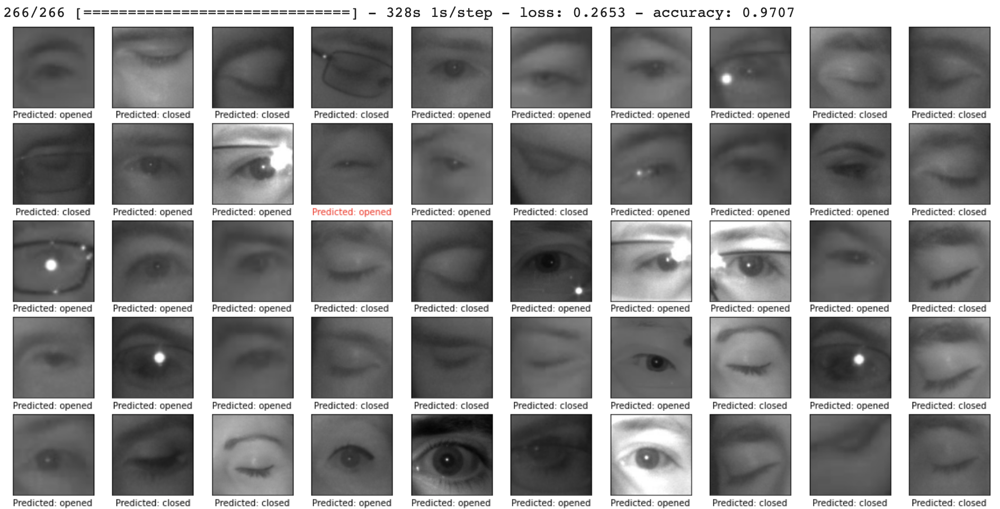

# Eye-Openness-TensorFlow

# Overview

The eye state classifier is based on transfer learning technique. I use transfer learning where we take a pre-trained network (trained on about a million general images), use it to extract features, and train a new layer on top for our own task of classifying images of eyes.

I used a [Model Maker](https://www.tensorflow.org/lite/tutorials/model_maker_image_classification) library that simplifies the process of adapting and converting a TensorFlow neural-network model to particular input data. The newly created model is based on MobileNetV2 backbone.

I provide full training code, data preparation scripts, and a pretrained model.

The classifier has speed **~17 ms/image** for `.tflite` floating model (image size is 224x224, CPU, 2 GHz Quad-Core Intel Core i5).

## Prepare dataset

Total images and classes:

  
    

  
Evaluate model:

   

## Model interference

<table>
	<tbody>
		<tr>
            <th>Configuration</th>
            <th>Config</th>
            <th>Model Type</th>
            <th>Time (avg)</th>
            <th>FPS</th>
		</tr>
		<tr>
			<td rowspan="2">Macbook Pro, CPU 2 GHz Quad-Core Intel Core i5</td>
            <td>CPU</td>
			<td>Floating</td>
            <td>17 ms</td>
            <td>58</td>
		</tr>
		<tr>
            <td>CPU</td>
			<td>Quantized</td>
            <td><a href='https://github.com/tensorflow/tensorflow/issues/21698'>900 ms</a></td>
            <td>1</td>
		</tr>
		<tr>
			<td rowspan="3">Xiaomi MI8 (SDM845, Adreno 630)</td>
            <td>CPU, 3 threads</td>
			<td>Floating</td>
            <td>35 ms</td>
            <td>28</td>
		</tr>
		<tr>
            <td>GPU</td>
			<td>Floating</td>
            <td>13 ms</td>
            <td>75</td>
		</tr>
        <tr>
            <td>CPU, 3 threads</td>
			<td>Quantized</td>
            <td>29 ms</td>
            <td>34</td>
		</tr>
		<tr>
			<td rowspan="3">Google Pixel (MSM8996, Adreno 530)</td>
            <td>CPU, 3 threads</td>
			<td>Floating</td>
            <td>48 ms</td>
            <td>17</td>
		</tr>
		<tr>
            <td>GPU</td>
			<td>Floating</td>
            <td>46 ms</td>
            <td>19</td>
		</tr>
        <tr>
            <td>CPU, 3 threads</td>
			<td>Quantized</td>
            <td>42 ms</td>
            <td>19</td>
		</tr>
	</tbody>
</table>

## How to use the pretrained model

To use the pretrained model you will need to download `run_inference.py` and  
a tensorflow lite model (`.tflite` file, it is [here](https://drive.google.com/drive/folders/1oZTsJ550O-z3ImMlgjWRBo9JhM9vOo6-?usp=sharing)). You can see an example of usage in `DrowinessTraining.ipynb`. 

## Image Dataset
The model was trained using image dataset [mrlEyes_2018_01](http://mrl.cs.vsb.cz/eyedataset).

## Requirements

* tensorflow 2.+ (inference was tested using tensorflow 2.4.0-dev20200810)
* tflite-model-maker (training was tested with 0.2.0)
* opencv-python

## Issues

If you find any problems or would like to suggest a feature, please
feel free to file an [issue](https://github.com/iglaweb/Eye-Openness-TensorFlow/issues)

## License

    Copyright 2020 Igor Lashkov

    Licensed under the Apache License, Version 2.0 (the "License");
    you may not use this file except in compliance with the License.
    You may obtain a copy of the License at

       http://www.apache.org/licenses/LICENSE-2.0

    Unless required by applicable law or agreed to in writing, software
    distributed under the License is distributed on an "AS IS" BASIS,
    WITHOUT WARRANTIES OR CONDITIONS OF ANY KIND, either express or implied.
    See the License for the specific language governing permissions and
    limitations under the License.